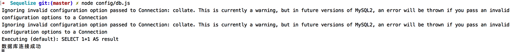

### 简介

> [官网 http://docs.sequelizejs.com](http://docs.sequelizejs.com)

Sequelize是一个基于promise的node.js ORM。到现在为止，它支持了Postgres、mysql、SQLite和Microsoft SQL Server，它具有强大的事务支持、关联联系、读取和复制的多种功能。

> ORM:Object Relational Mapping，简称ORM，对象关系映射。可参考[ORM](ORM.md)

#### 安装

可以通过NPM或者yarn安装。

> node的很多包都是可以通过NPM或者yarn方式安装的，两种方式的安装都各有优势，在接下来的介绍中，只介绍通过NPM方式安装。

```javascript
npm install sequelize --save
npm install mysql mysql2 --save
```

由于我的测试数据库为mysql，在这里同时将mysql依赖一起安装了。如果各位看官有使用Postgres或者SQLite、Microsoft SQL Server的，只要安装相应的依赖就可以了。

建立连接

```javascript
const Sequelize = require('sequelize');
const sequelize = new Sequelize('sequelize','root','',{
	host:'localhost',
	dialect:'mysql',
	operatorsAliases:false,
    dialectOptions:{
        //字符集
        charset:'utf8mb4',
        collate:'utf8mb4_unicode_ci',
        supportBigNumbers: true,
        bigNumberStrings: true
    },
    pool:{
        max: 5,
        min: 0,
        acquire: 30000,
        idle: 10000
    },
    timezone: '+08:00'  //东八时区
});
```

链接代码建立之后，我们首先需要测试下链接是否成功。一个程序员得养成写一段代码就及时测试的好习惯，避免代码写了好多，从来没有运行过，等大部分的代码都写完了，一测试运行，完全跑不通的情况发生。

由于我们这里没有具体的业务代码，也没有后续的功能代码，我们这段代码的主要目的就是链接数据库，我们要验证的也是代码与数据库的连接是否成功。sequelize为我们提供了authenticate来测试连接。

```javascript
sequelize.authenticate().then(() => {
    console.log('数据库连接成功');
  })
  .catch(err => {
    console.error('数据库连接失败', err);
  });
```

我们可以通过使用node来执行js文件

```javascript
node config/db.js
```

如果执行结果如下，说明连接数据库成功：



### 创建模型

语法
```javascript
sequelize.define('name',{attributes},{options})
```
